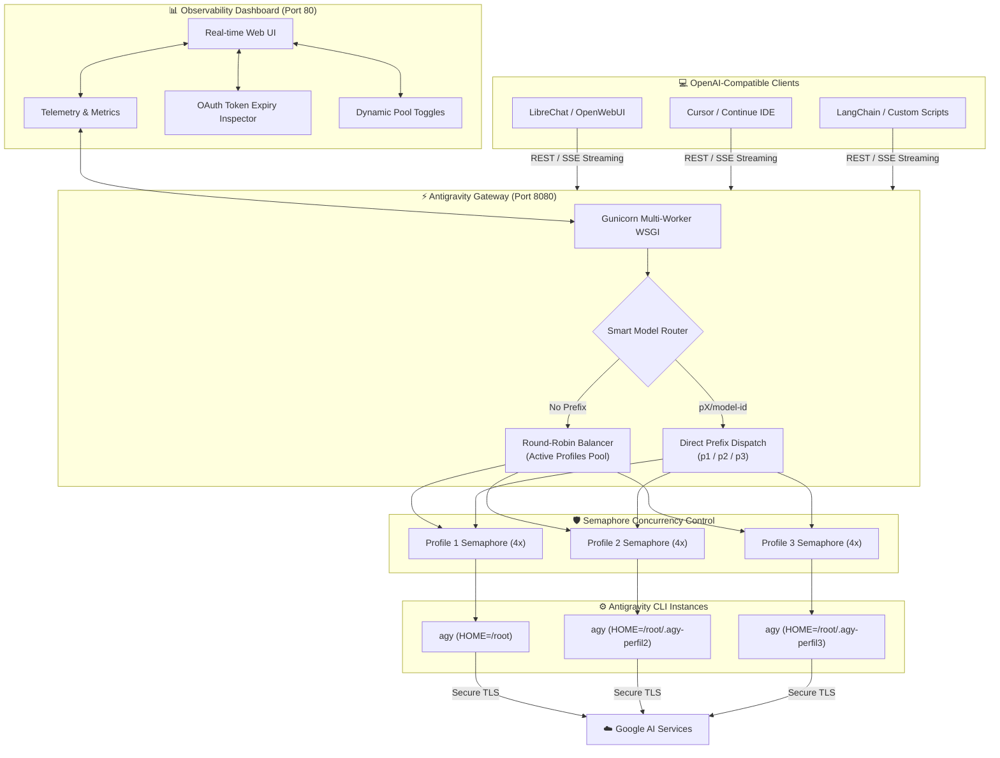
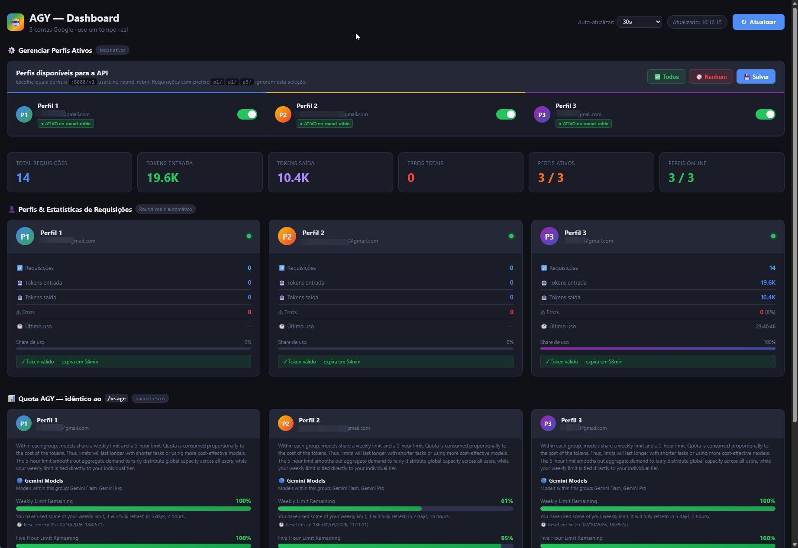
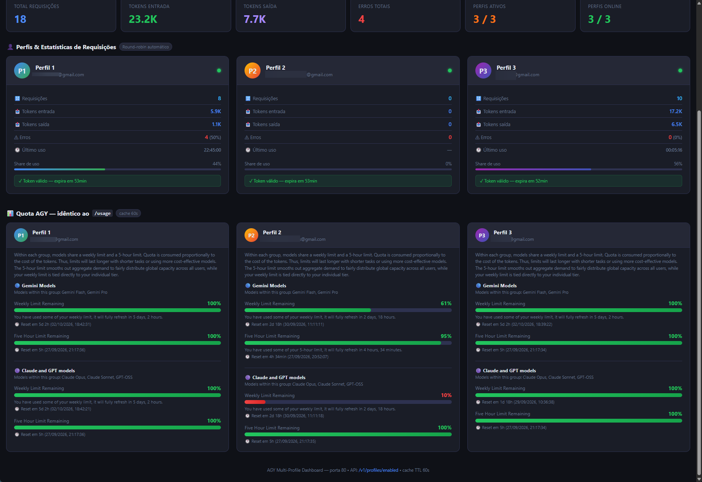

<div align="center">

# ⚡ Antigravity API & Dashboard
### *High-Throughput OpenAI-Compatible AI Gateway with Multi-Account Round-Robin & Real-Time Observability*

[](LICENSE)
[](https://python.org)
[](https://platform.openai.com/docs/api-reference)
[](https://palletsprojects.com/p/flask/)
[](https://github.com/marceloasl99/antigravity-api-dashboard/pulls)

<p align="center">
  <a href="#-overview">Overview</a> •
  <a href="#-key-features">Key Features</a> •
  <a href="#-architecture">Architecture</a> •
  <a href="#-web-dashboard">Web Dashboard</a> •
  <a href="#-quickstart">Quickstart</a> •
  <a href="#-multi-account-setup">Multi-Account Setup</a> •
  <a href="#-api-reference--routing">API Reference</a> •
  <a href="#-integrations">Integrations</a> •
  <a href="#-security">Security</a>
</p>

---

</div>

## 📖 Overview

**Antigravity API & Dashboard** turns Google's **Antigravity CLI (`agy`)** into an enterprise-grade, **OpenAI-compatible REST API gateway** with automated **multi-account pool load balancing** and a **sleek real-time web dashboard**.

If you use Google Antigravity locally and hit quota ceilings or want to integrate state-of-the-art models (**Gemini 3.8 Flash**, **Gemini 3.1 Pro**, **Claude Sonnet 4.6**, **Claude Opus 4.6**, **GPT-OSS**) into your favorite OpenAI-compatible applications (**LibreChat**, **OpenWebUI**, **LiteLLM**, **Cursor**, **LangChain**), this project provides a unified, self-hosted solution.

> 🌐 **100% Private & Self-Hosted**: Runs entirely in your homelab or private container (Proxmox LXC, Docker, Ubuntu/Debian). No third-party relays, no telemetry, zero token leakage.

---

## ✨ Key Features

| Feature | Description |
| :--- | :--- |
| 🔌 **Drop-in OpenAI Compatibility** | Implements `/v1/chat/completions` (with Server-Sent Events SSE streaming) and `/v1/models` to work seamlessly with existing tools. |
| 🔄 **Multi-Account Round-Robin** | Pool multiple Google accounts together to distribute workload, multiply rate limits, and eliminate throttling. |
| 🎯 **Precision Account Routing** | Route requests to specific accounts using model prefixes (e.g. `p1/gemini-3.8-flash-low`, `p2/claude-sonnet-4-6`) or omit prefix for automatic load balancing. |
| 📊 **Real-Time Web Dashboard** | A modern, responsive web app on port `80` tracking token consumption, latency, error rates, and live OAuth token expiration. |
| 🎛️ **Dynamic Profile Management** | Enable or disable individual accounts from the round-robin rotation live from the UI without restarting servers. |
| 🚦 **Thread-Safe Concurrency Pools** | Per-profile semaphore queues safeguard against subprocess resource contention and CLI deadlocks. |
| 🐧 **Production-Ready Daemon** | Pre-configured `systemd` unit files for 24/7 background operation with automatic recovery and Gunicorn multi-worker orchestration. |

---

## 🏛️ Architecture



---

## 📊 Web Dashboard Interface

The embedded dashboard serves as your local mission control center accessible directly at `http://<your-server-ip>/`:

```text
┌────────────────────────────────────────────────────────────────────────────────────────┐
│  ⚡ AGY Antigravity Hub — Real-Time Cluster Monitor               [ 🔄 Auto-Refresh: 10s ]│
├────────────────────────────────────────────────────────────────────────────────────────┤
│  TOTAL REQUESTS: 1,482   │  TOKENS IN: 412,890   │  TOKENS OUT: 894,120  │  ACTIVE: 3/3│
├────────────────────────────────────────────────────────────────────────────────────────┤
│  ACCOUNTS & PROFILES                                                                   │
│  ┌───────────────────────┐  ┌───────────────────────┐  ┌───────────────────────┐       │
│  │ 🟢 Profile 1 (Default)│  │ 🟢 Profile 2         │  │ 🟢 Profile 3         │       │
│  │ Token: Valid (4h 12m) │  │ Token: Valid (5h 01m) │  │ Token: Valid (3h 48m) │       │
│  │ Reqs: 512 | Err: 0%   │  │ Reqs: 489 | Err: 0%   │  │ Reqs: 481 | Err: 0%   │       │
│  │ [● Active in Pool   ] │  │ [● Active in Pool   ] │  │ [● Active in Pool   ] │       │
│  └───────────────────────┘  └───────────────────────┘  └───────────────────────┘       │
├────────────────────────────────────────────────────────────────────────────────────────┤
│  MODEL TEST PLAYGROUND & PROMPT INSPECTOR                                              │
│  Model: [ gemini-3.8-flash-low  ▼ ]   Profile: [ Automatic Round-Robin ▼ ]             │
│  Prompt: [ What are the key architectural benefits of sparse mixture of experts?     ] │
│  Response: [ ⚡ Streaming output rendered in real-time with latency benchmarks...     ]│
└────────────────────────────────────────────────────────────────────────────────────────┘
```

---

## 🚀 Quickstart

### 1. Prerequisites
Ensure you are running an Ubuntu/Debian environment (or Proxmox LXC container) with Python 3.10+ installed:

```bash
# Update and install system dependencies
sudo apt-get update -y
sudo apt-get install -y python3 python3-pip python3-flask python3-flask-cors gunicorn curl
```

### 2. Install the Antigravity CLI
Install the official Antigravity CLI binary if not already present:

```bash
curl -L https://antigravity.google/install.sh | bash
export PATH="$HOME/.local/bin:$PATH"
```

### 3. Clone Repository
```bash
git clone https://github.com/marceloasl99/antigravity-api-dashboard.git
cd antigravity-api-dashboard
pip install -r requirements.txt
```

---

## 🔐 Multi-Account Setup

The Antigravity CLI persists tokens inside `$HOME/.gemini/antigravity-cli/`. To isolate multiple accounts without collision, we point each account to a dedicated `$HOME` directory:

### Step 1: Log in to Account 1 (Primary)
```bash
agy auth login
```

### Step 2: Log in to Account 2
```bash
mkdir -p /root/.agy-perfil2
HOME=/root/.agy-perfil2 /root/.local/bin/agy auth login
```

### Step 3: Log in to Account 3
```bash
mkdir -p /root/.agy-perfil3
HOME=/root/.agy-perfil3 /root/.local/bin/agy auth login
```

*(Optional) Create shell aliases in `~/.bashrc`:*
```bash
echo 'alias agy2="HOME=/root/.agy-perfil2 /root/.local/bin/agy"' >> ~/.bashrc
echo 'alias agy3="HOME=/root/.agy-perfil3 /root/.local/bin/agy"' >> ~/.bashrc
source ~/.bashrc
```

### Step 4: Configure Profiles
Copy the profile template and customize:
```bash
cp profiles.example.json profiles.json
```
```json
[
  {
    "id": "p1",
    "name": "Production Account",
    "email": "user1@company.com",
    "home": "/root",
    "concurrency": 4
  },
  {
    "id": "p2",
    "name": "Secondary Account",
    "email": "user2@company.com",
    "home": "/root/.agy-perfil2",
    "concurrency": 4
  },
  {
    "id": "p3",
    "name": "Fallback Account",
    "email": "user3@company.com",
    "home": "/root/.agy-perfil3",
    "concurrency": 4
  }
]
```

---

## 🔄 Daemon Setup (Systemd)

Run the API and Dashboard automatically on boot:

```bash
# 1. Copy unit files
sudo cp systemd/agy-api.service /etc/systemd/system/
sudo cp systemd/agy-dashboard.service /etc/systemd/system/

# 2. Reload and enable
sudo systemctl daemon-reload
sudo systemctl enable --now agy-api.service
sudo systemctl enable --now agy-dashboard.service

# 3. Check health status
sudo systemctl status agy-api.service
sudo systemctl status agy-dashboard.service
```

---

## 📡 API Reference & Routing

The gateway is exposed at `http://<server-ip>:8080/v1`.

### Supported Models

| Model ID | Provider | Description |
| :--- | :--- | :--- |
| `gemini-3.8-flash-low` | Google | Ultra-low latency, optimal for high-throughput agents |
| `gemini-3.8-flash-high` | Google | Extended reasoning capacity and complex query handling |
| `gemini-3.1-pro-low` | Google | General production workloads and coding tasks |
| `gemini-3.1-pro-high` | Google | Deep analytical capabilities and context processing |
| `claude-sonnet-4-6` | Anthropic | High-precision coding and structural reasoning |
| `claude-opus-4-6-thinking` | Anthropic | Architectural problem-solving with chain-of-thought |
| `gpt-oss-120b-medium` | Open Source | Open weights model tuned for code and summarization |

### Prefix Routing Rules

- **Standard Round-Robin** (Recommended):  
  Pass the model ID directly (e.g., `"model": "gemini-3.8-flash-low"`). The gateway rotates through active accounts.
- **Pinpoint Routing**:  
  Prepend the profile ID (e.g., `"model": "p2/gemini-3.8-flash-low"`). The request bypasses round-robin and routes exclusively to Account 2.

---

## 🔌 Integrations

### Python OpenAI SDK
```python
from openai import OpenAI

client = OpenAI(
    base_url="http://10.0.0.108:8080/v1",  # Replace with your gateway IP
    api_key="none"                         # No API key required locally
)

# Standard non-streaming call with round-robin
response = client.chat.completions.create(
    model="gemini-3.8-flash-low",
    messages=[
        {"role": "system", "content": "You are a concise engineering assistant."},
        {"role": "user", "content": "Explain raft consensus in two sentences."}
    ]
)
print(response.choices[0].message.content)
```

### Streaming via cURL
```bash
curl -N -X POST http://localhost:8080/v1/chat/completions \
  -H "Content-Type: application/json" \
  -d '{
    "model": "claude-sonnet-4-6",
    "stream": true,
    "messages": [
      {"role": "user", "content": "Write a python generator for fibonacci numbers."}
    ]
  }'
```

### LibreChat / OpenWebUI Configuration
Add to your `librechat.yaml` or OpenWebUI custom connections:
```yaml
endpoints:
  custom:
    - name: "Antigravity Gateway"
      apiKey: "local"
      baseURL: "http://<YOUR_CONTAINER_IP>:8080/v1"
      models:
        default: ["gemini-3.8-flash-low", "gemini-3.1-pro-high", "claude-sonnet-4-6"]
        fetch: true
```

---

## 🛡️ Security & Git Hygiene

- **Sensitive Isolation**: Tokens and auth sessions are saved strictly within local OS directories (`.gemini/`, `.agy-perfilX/`).
- **Comprehensive `.gitignore`**: The included `.gitignore` guarantees that `profiles.json`, `.env`, OAuth tokens, SSH keys, virtualenvs, and system caches are excluded from Git commits.
- **Zero Cloud Intermediaries**: All communication is direct from your server to Google Cloud Code endpoints.

---

## 🤝 Contributing

Contributions, issues, and feature requests are welcome!  
Feel free to check [issues page](https://github.com/marceloasl99/antigravity-api-dashboard/issues).

1. Fork the Project
2. Create your Feature Branch (`git checkout -b feature/AmazingFeature`)
3. Commit your Changes (`git commit -m 'feat: Add AmazingFeature'`)
4. Push to the Branch (`git push origin feature/AmazingFeature`)
5. Open a Pull Request

---

## 📄 License

Distributed under the **MIT License**. See [`LICENSE`](LICENSE) for more information.

<div align="center">
  <sub>Built with ❤️ for homelabs and AI enthusiasts.</sub>
</div>

## 📸 Dashboard Screenshots
### 🎛️ Account Profile Manager & Cluster Status

### 📊 Real-Time Quota Telemetry & Request Statistics

